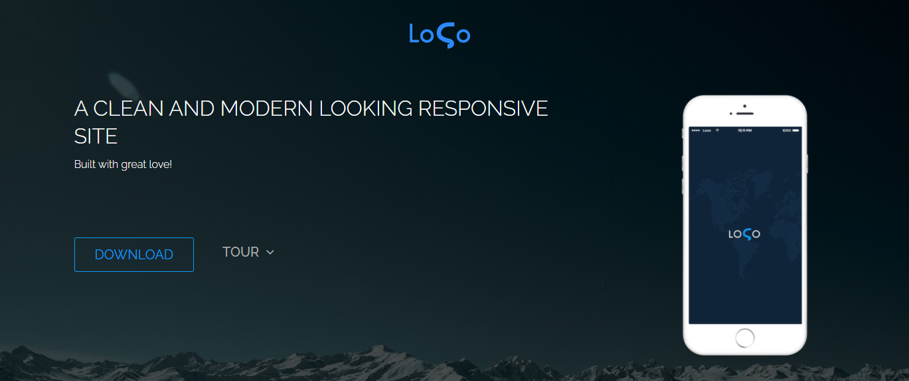

# Modern - Simple Website, Clean and Responsive

## Portuguese Description:

Esse site consiste em um template de uma landing page feito durante o meu curso
técnico de informática em 2018 pela Escola Técnica Pandiá Calógeras.

O conteúdo foi passado pelo professor Júlio Vitorino e desenvolvido pelos 
alunos. Veja o perfil de Júlio no
[LinkedIn](https://www.linkedin.com/in/juliovitorino/).

Em 2022 refatorei o site, atualizando as tecnologias presentes.

O site foi criado baseado nas seguintes linguagens e frameworks:

- HTML;
- CSS;
- Bootstrap.
